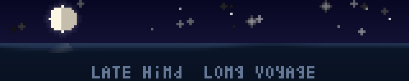

<h1 align="center">Hi, I'm totoro-jam 👋</h1>

  <i>✨🌌A late wind is still a wind — ⛵️long voyage</i>

  🇨🇳 China · 🧑‍💻 Software Engineer · Open Source

  
  
  
  
  
  

## Projects

<a href="https://patterns.totorojam.com">
  
  <b>Battle-Tested Patterns</b>
</a>

*46 patterns from React, Linux, Go & Redis source — with source links, 4-language exercises, and interactive viz.*

 

